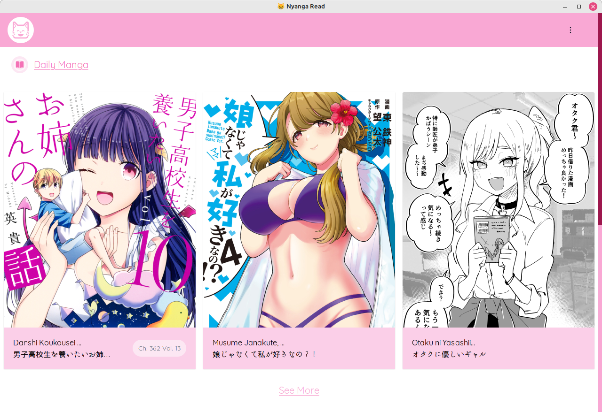
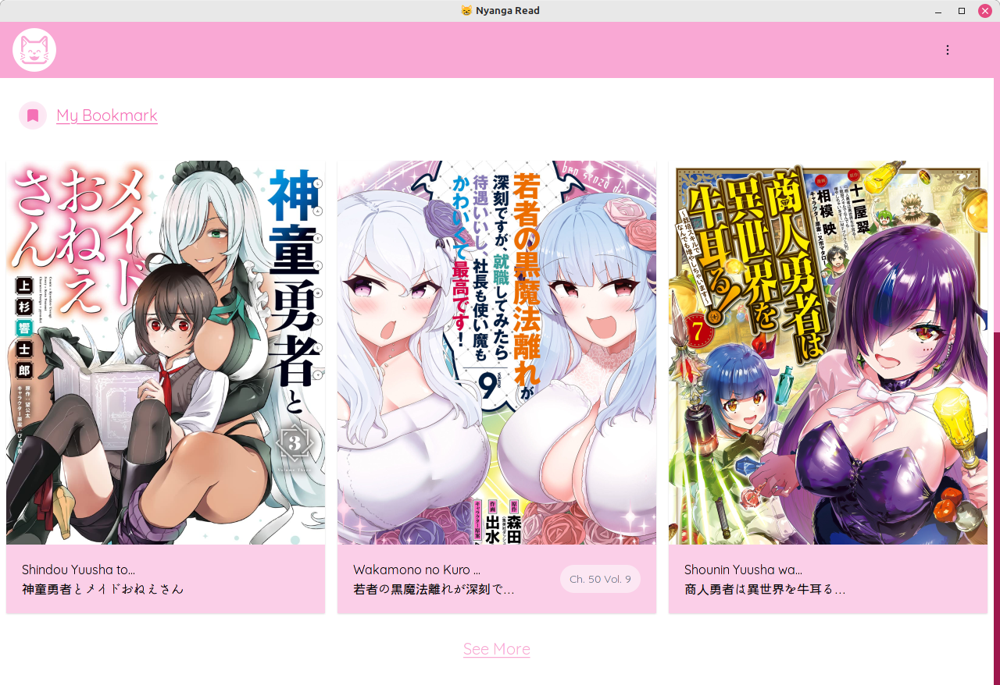
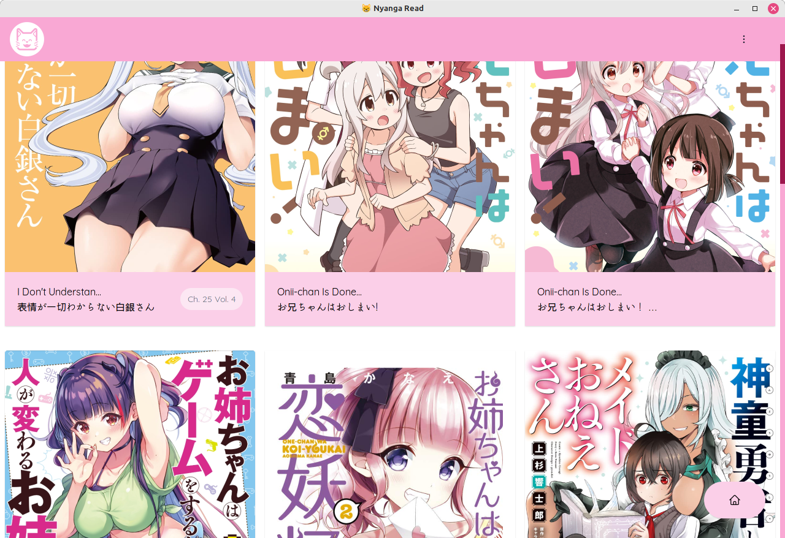
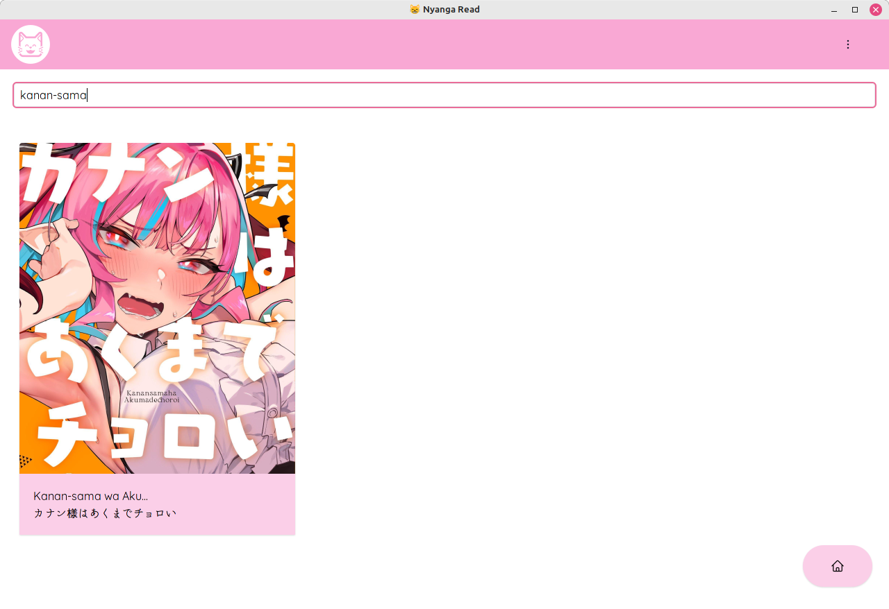
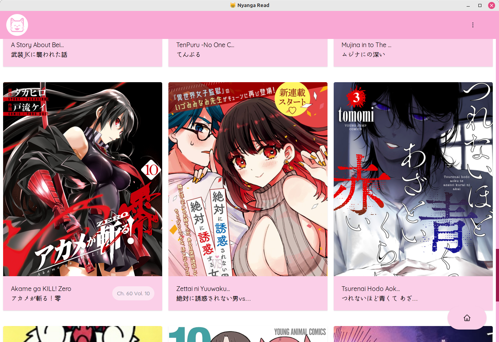
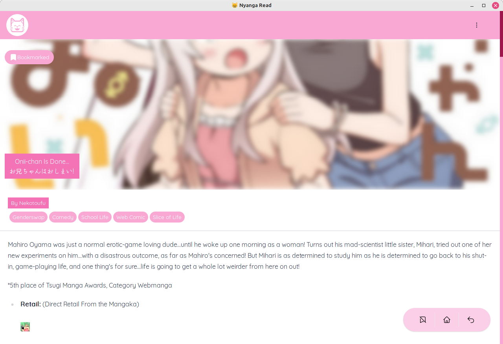
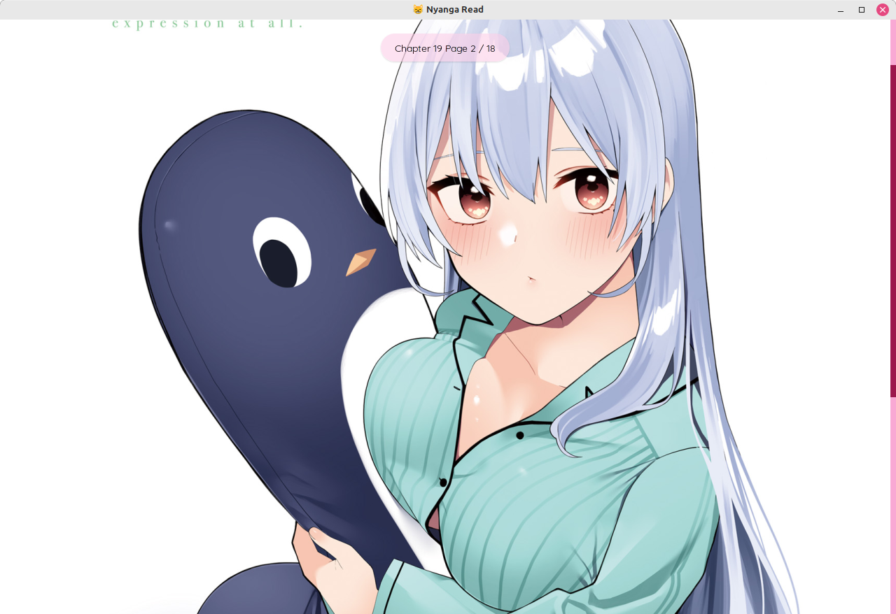
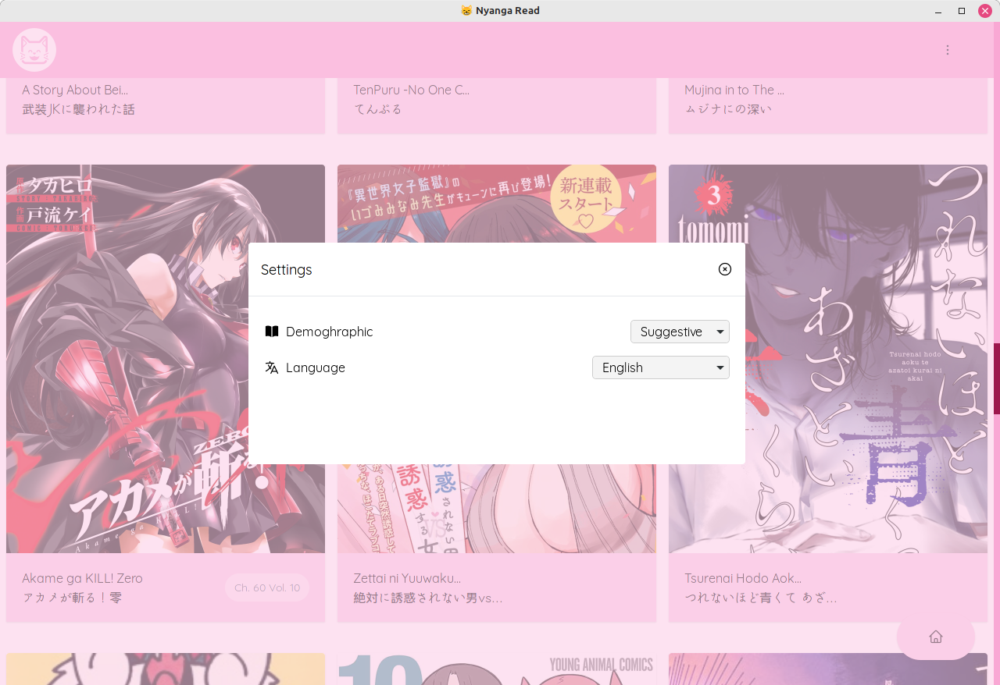

  

# Nyanga Read 😸

---

Manga Reader for desktop powered by sveltekit, mangadex, and pywebview.

- ✅ Transalated manga based on what language you choose
- ✅ Local bookmark save

  

<i>Main Page preview</i>

  

<i>bookmark list and local bookmark support</i>

  

<i>bookmark page lists</i>

  

<i>search page</i>

  

<i>list all of random daily page</i>

  

<i>volume and chapter selection</i>

  

<i>Full HD image quality provided by <a href="https://mangadex.org">mangadex</a></i>

  

<i>demographic and language selection</i>

## Help me transalating application

currently this application available only in 2 language, _english_ and _Bahasa Indonesia_, if you feel you can help me transalating this application by transalating you can follow step below

Before you transalating application please check available manga transalated language from [mangadex source](https://api.mangadex.org/docs/static-data/)

## Developing new features / adding transalation

- requirements and installation

  - Requirements
    - node version `18.12.1` or higher (need to be compatilbe with yarn version 3.2.1) or equivalent version
    - yarn version `4.2.2` or equivalent package manager tools,
    - python `3.11.2` or newer (needed for windowing system)
    - poetry `1.8.3` or newer for build tool
  - setting up development

    - Python environment

      - make sure you already installing python poetry (used for package management in python, although i'm still not sure if pyinstaller still bundling pyinstaller in binary, it is still convenient for automating build in github workflow.) refer to [this](https://python-poetry.org/docs/#installing-with-the-official-installer) page how to set up your python with poetry.
      - install package by using poetry with `poetry install --with dev`

    - Node environment

      - run `yarn install` from root folder
      - yarn run `svelte:dev`
      - **Optional** if you have already run `poetry install --with dev` and have yarnpkg installed, then you can install ui dependencies with running command `poetry run install_ui_dep`

    - Testing

      - **Testing flag / Environment variable**

        in building / editing / testing you maybe want to know some env. variable flag that used during testing UI, and preview or used by python system itself. below is the env. variable flag this application needed

        - **`APP_ENV=dev`** used for testing when developing UI, adding new features, and if you generally want to modify UI without losing it autoreload from nodejs.
        - **`APP_ENV=preview`** usually used for previewing any UI that have been build. or in case you need to supply front-end some [pywebview token](https://pywebview.flowrl.com/guide/api.html#webview-token)

      - UI development

        - open up new terminal, then run command `poetry run start_ui`
        - in another terminal you need to use flag / env. variable `APP_ENV=dev`
        - then run command `poetry run dev`.

      - Window / Ipc testing

        for testing window / ipc testing you need to build your UI because some component such as storage in the ipc end-point is protected by pywebview token for security.

        in this step stdout is redirected to `(root folder)/nyanga/log/app.log` file to keep your stdout in terminal clean, some exception is still can escape to stdout in terminal, so when you have any issue when developing feature that related to windowing, ipc, and storage you want keep your eyes in this file.

        below is the step to how do you build your UI first, then running the ipc / window testing step.

        - build your ui by using poetry

          - in root folder you can typing `poetry run build_ui`, this is automatically installing your front-end dependencies if it not available, and then build your UI front-end.

        - build your ui without using poetry (using yarn, or any node package manager that you already have).

          - if not you need to install development dependencies first by running command `yarn install` inside folder `(root folder)/nyanga`.
          - then you can run command `yarn run svelte:build`.

        - for testing your code in testing / preview mode you can run `export APP_ENV=preview` then run command `poetry run dev` again.

      - Building locally

        for building this project locally (altought i'm not recommending it because it will make the binary file size fat, and don't know why), you can follow step bellow.

        - in root folder, build your UI first by running `poetry run buld_ui`.
        - then you can run `poetry build_(linux / window)` for building in your os.

  - Transalating

    - follow the step above.
    - add translation file in folder `src/lib/i18n/locales` file naming convention using `<language Code>.json` use [this reference](https://www.w3docs.com/learn-html/html-language-codes.html).
    - for json structure you can following example from file `src/lib/i18n/locales/en.json`
    - then add your language to `src/routes/+layout.svelte` under comment `<add your language here>`
    - test your change by running step `testing` above.

  - Submit your transalation by sending me _gitlab pull request_, i'll review it before merging it to main branch.

## Supported OS

from version 3.0.4 to 3.0.10, currently still being build for linux specifically for debian based distro. for version 3.15.0 build tools and workflow will be able to build for windows again, because i didn't feel like i want to configuring buildtools and the gh-workflow.

## Note

this application not including _manhua_ or _manhwa_ by default because i just want to read some JP manga, but you can request to add it to application, and i did not include tag _Boys Love_ because i mean come on 😕, and no i will not add this tag to application.

## Bugfix & Feature request

if you found some bug or you feel this apps will need some crucial feature you can submit new issue.

---

### Ulauncher extension for nyanga-read ✨.

extend your [ulauncher](https://ulauncher.io/) with [ulauncher-nyanga](https://github.com/IDNatte/ulauncher-nyanga) to use it, go to [ulauncher-nyanga](https://github.com/IDNatte/ulauncher-nyanga) github repo.
