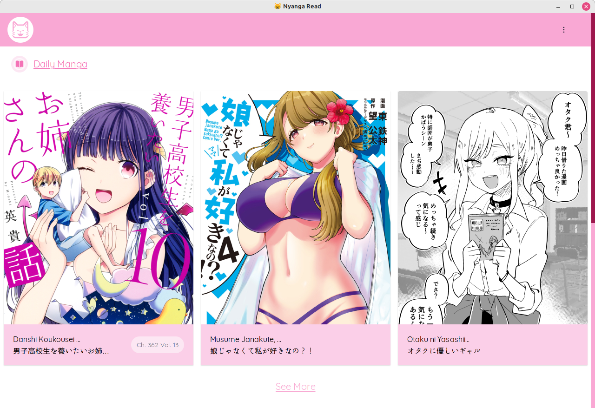
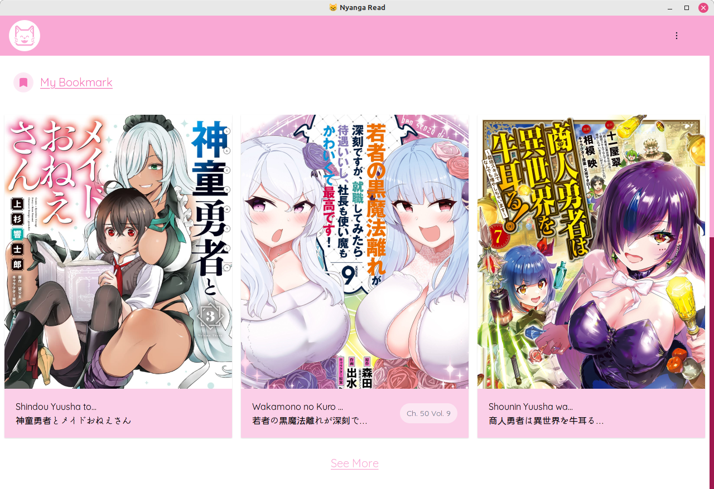
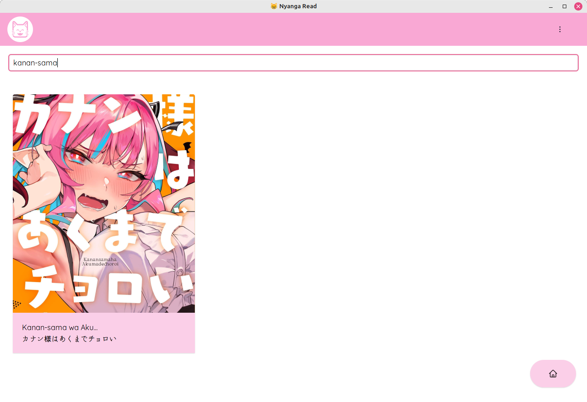
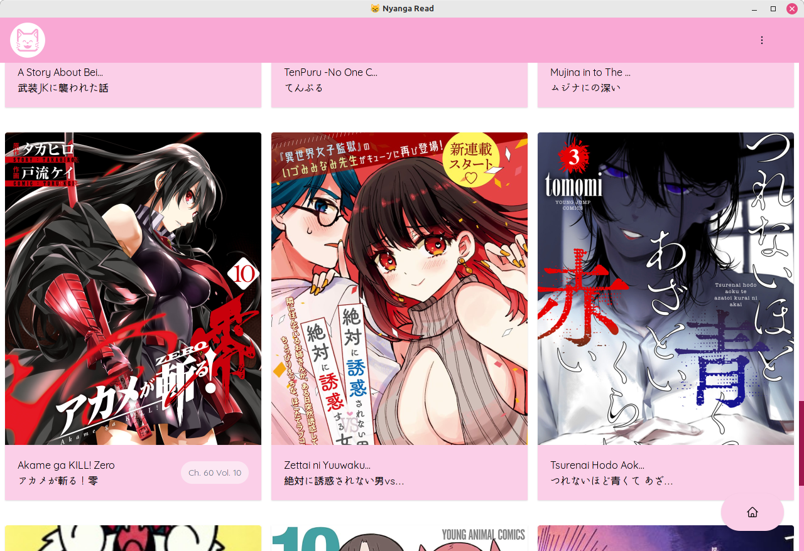
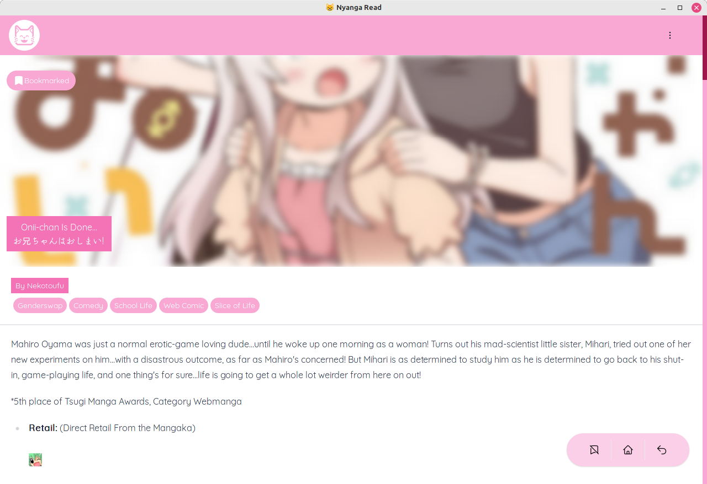
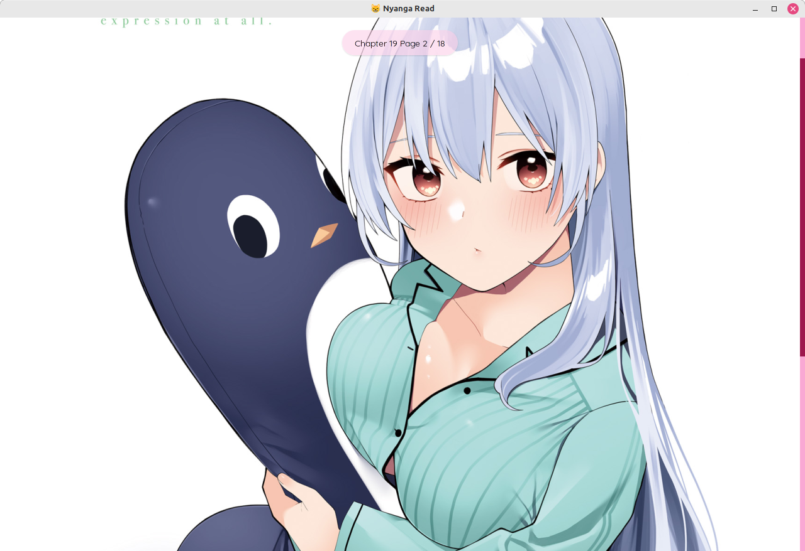
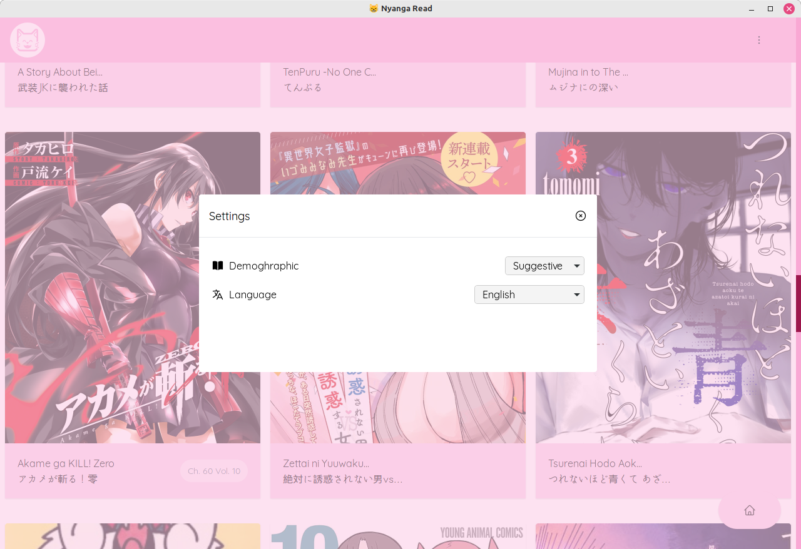

  

# Nyanga Read 😸

---

Manga Reader for desktop powered by sveltekit, mangadex, and pywebview.

- ✅ Transalated manga based on what language you choose
- ✅ Local bookmark save

  

<i>Main Page preview</i>

  

<i>bookmark list and local bookmark support</i>

  

<i>bookmark page lists</i>

  

<i>search page</i>

  

<i>list all of random daily page</i>

  

<i>volume and chapter selection</i>

  

<i>Full HD image quality provided by <a href="https://mangadex.org">mangadex</a></i>

  

<i>demographic and language selection</i>

## Help me transalating application

test
currently this application available only in 2 language, _english_ and _Bahasa Indonesia_, if you feel you can help me transalating this application by transalating you can follow step below

- Before you transalating application please check available manga transalated language from [mangadex source](https://api.mangadex.org/docs/static-data/)
- Fork this repo
- requirements and installation

  - requirements :
    - node version `18.12.1` or higher (need to be compatilbe with yarn version 3.2.1) or equivalent version
    - yarn version `3.3.1` or equivalent package manager tools,
    - python 3.8 or newer (needed for windowing system)
  - setting up development

    - python

      - inside root folder create python virtual environment with typing `python3 -m venv .venv --upgrade-deps`
      - use the newly created python virtual env by running `source ./venv/bin/activate` if you using linux, or `.\.venv\Script\Activate.ps1` if you using windows
      - then install the required package by running `pip install -r requirements-(win / linux).txt`

    - node environment

      - run `yarn install` from root folder
      - yarn run `svelte:dev`

    - testing

      - UI Testing

        - first you need to start the UI server with command `yarn run svelte:dev`
        - then run `yarn run python:(win / linux):ui:dev`

      - window and ipc testing

        - first you need to start the UI server with command `yarn run svelte:dev`
        - then run `yarn run python:(win /linux):start` to test your ipc or window changes

      - building
        - first run the UI build command `yarn run svelte:build`
        - then run in new console start your's python virtual environment
        - then run `pyinstaller --noconfirm ./Nyanga-read-(windows / linux).spec`

  - Transalating

    - follow the step above.
    - add translation file in folder `src/lib/i18n/locales` file naming convention using `<language Code>.json` use [this reference](https://www.w3docs.com/learn-html/html-language-codes.html).
    - for json structure you can following example from file `src/lib/i18n/locales/en.json`
    - then add your language to `src/routes/+layout.svelte` under comment `<add your language here>`
    - test your change by running step `testing` above.

  - Submit your transalation by sending me _gitlab pull request_, i'll review it before merging it to main branch.

## Note

this application not including _manhua_ or _manhwa_ by default because i just want to read some JP manga, but you can request to add it to application, and i did not include tag _Boys Love_ because i mean come on 😕, and no i will not add this tag to application.

## Bugfix & Feature request

if you found some bug or you feel this apps will need some crucial feature you can submit new issue.

---

### Ulauncher extension for nyanga-read ✨.

extend your [ulauncher](https://ulauncher.io/) with [ulauncher-nyanga](https://github.com/IDNatte/ulauncher-nyanga) to use it, go to [ulauncher-nyanga](https://github.com/IDNatte/ulauncher-nyanga) github repo.
