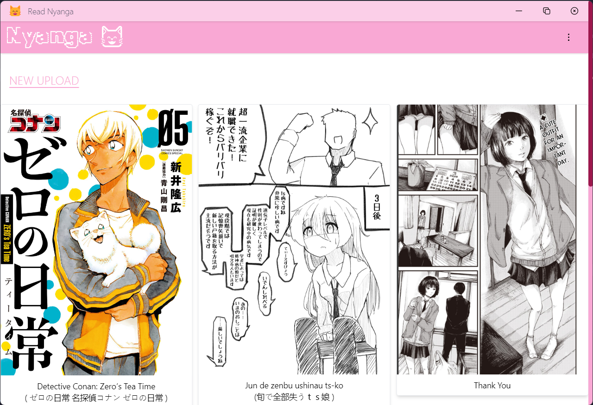
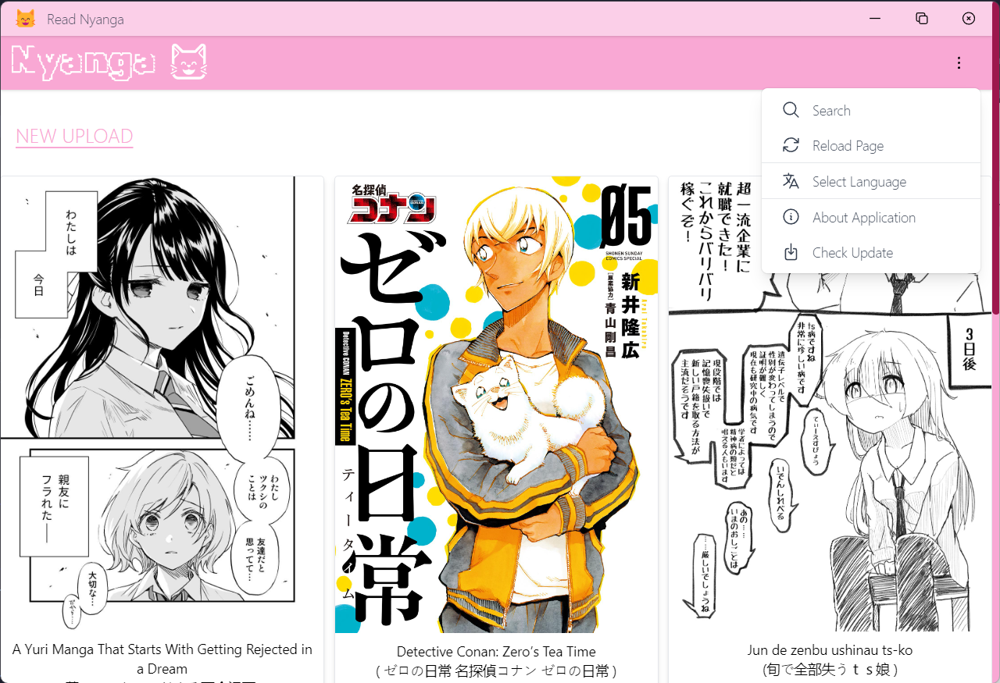
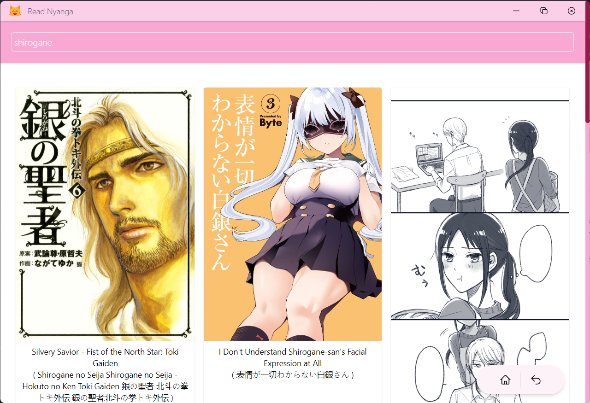
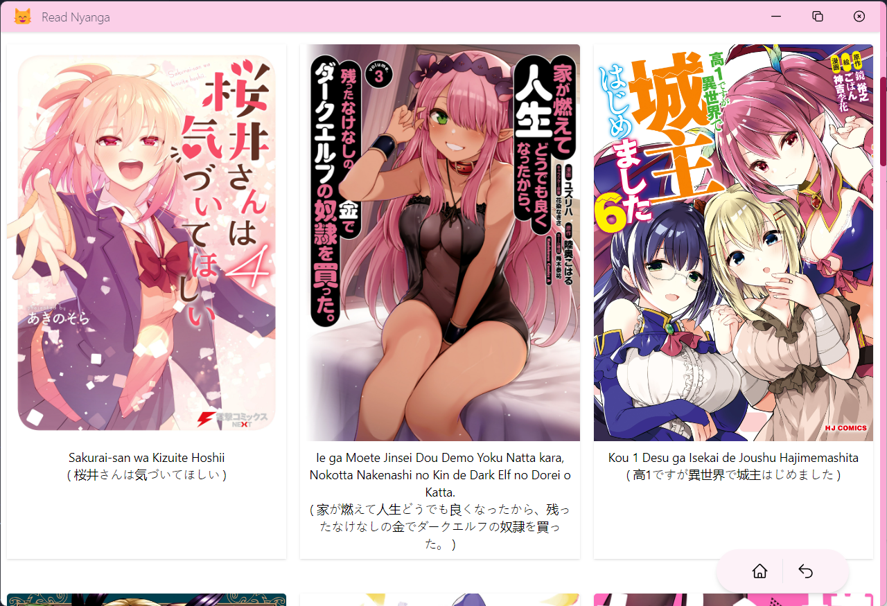
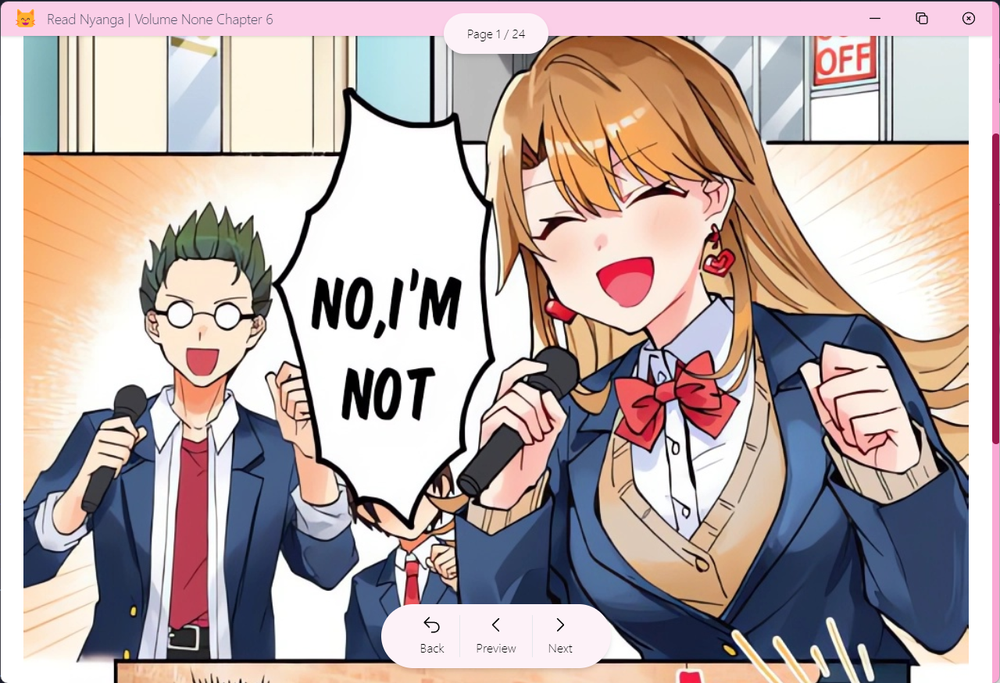

  

# Nyanga Read 😸

Manga Reader for desktop powered by sveltekit, mangadex, and electron.

- Transalated manga based on what language you choose
- Local bookmark save

  

<i>Main Page preview</i>

  

<i>Option</i>

  

<i>Search page</i>

  

<i>Local bookmark support</i>

  

<i>volume and chapter selection</i>

  

<i>Full HD image quality</i>

## Help me transalating application

currently this application available only in 2 language, _english_ and _Bahasa Indonesia_, if you feel you can help me transalating this application by transalating you can follow step below

- Before you transalating application please check available manga transalated language from [mangadex source](https://api.mangadex.org/docs/static-data/)
- Fork this repo
- requirements and installation

  - requirements :
    - node version `18.12.1` or higher (need to be compatilbe with yarn version 3.2.1) or equivalent version
    - yarn version `3.3.1` or equivalent package manager tools
  - setting up development

    - run `yarn install` from root folder
    - then run `yarn install` from `./layout/` folder

  - Transalating

    - add transaltion file in folder `/layout/src/lib/i18n/locales` file naming convention using `<language Code>.json` use [this reference](https://www.w3docs.com/learn-html/html-language-codes.html).
    - for json structure you can following example from file `/layout/src/lib/i18n/locales/en.json`

  - Submit your transalation by sending me _github pull request_, i'll review it before merging it to main branch.

## Note

this application not including _manhua_ or _manhwa_ by default because i just want to read some JP manga, but you can request to add it to application, and i did not include tag _Boys Love_ because i mean come on 🫤, and no i will not add this tag to application.

## Bugfix & Feature request

if you found some bug or you feel this apps will need some crucial feature you can submit new issue.
